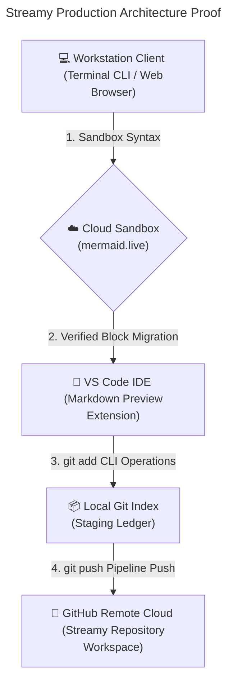
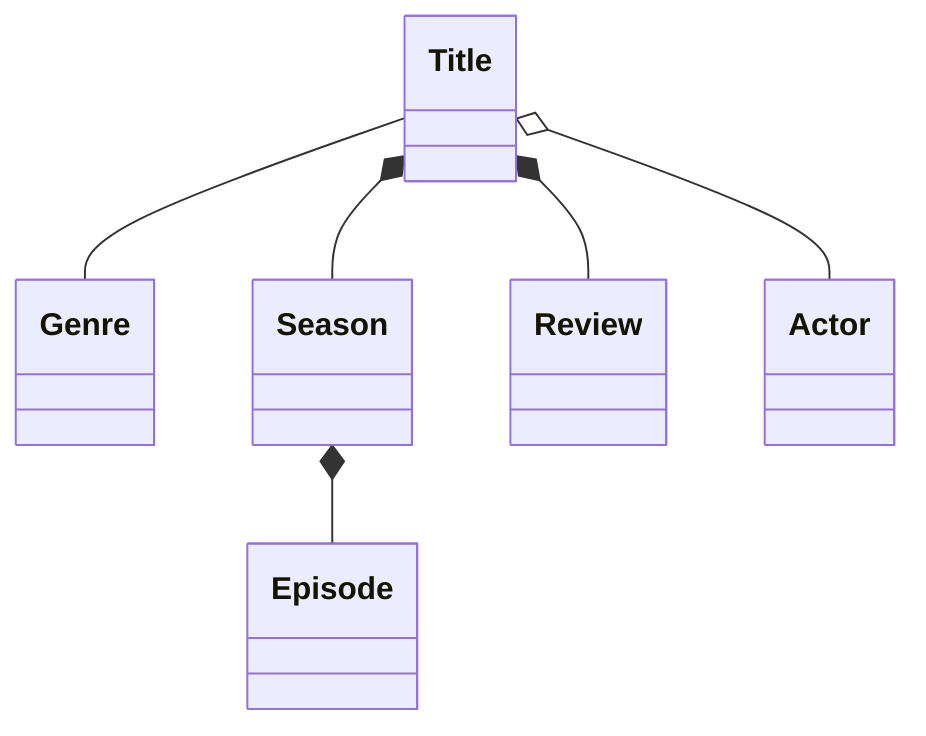
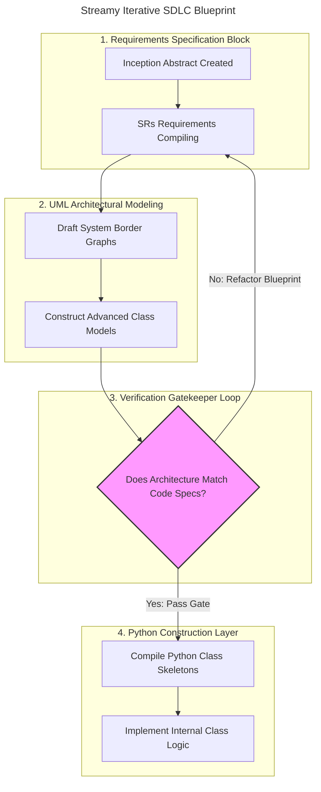
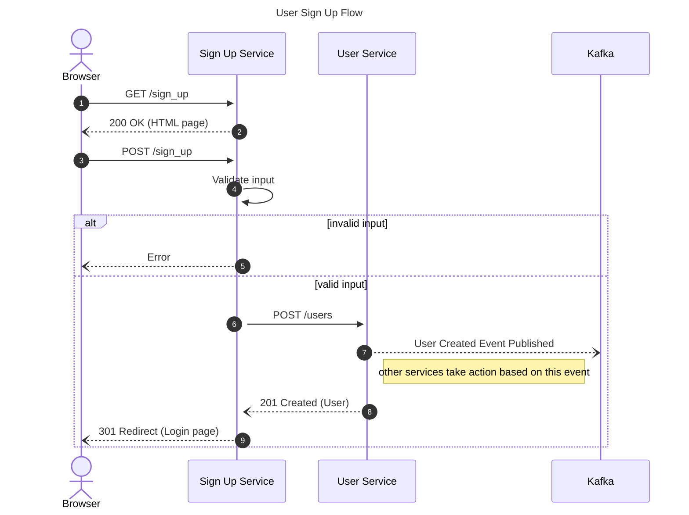

# Streamy Video Streaming Backend Platform

Software Technology Course Laboratory Node

- **Student Identity:** [XU HAOJIE]
- **Neptun System Code:** [DTR5N0]
- **Course Section Reference:** GEIAL314-B2a

## Workspace Environment Architecture

The diagram below maps out how our development environment connects local code authoring to remote version tracking, using a **Diagrams-as-Code** design pipeline.

## Domain Model - UML Class Diagram

## Streamy Application Engineering Development Lifecycle

为保证 **Streamy** 实现周期内的系统化跟踪，我们的开发者流水线遵循如下结构化迭代门禁审查框架。

## User Sign Up Flow

