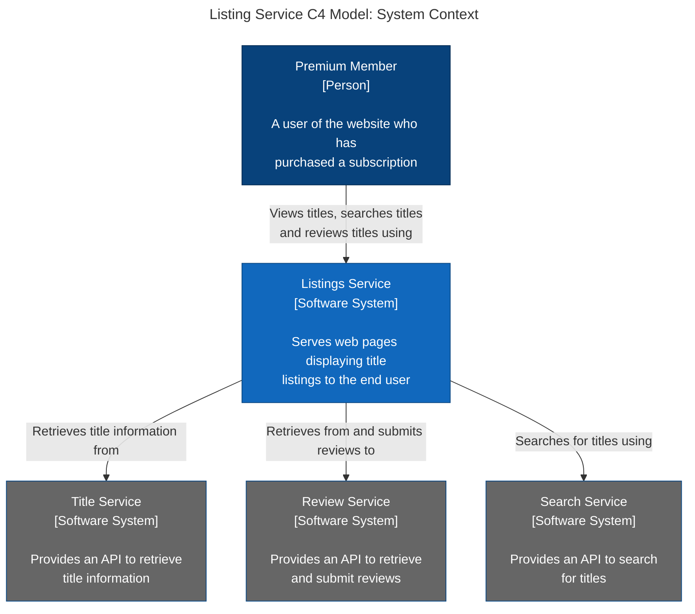

# Listing Service C4 Model: System Context

```mermaid
---
title: "Listing Service C4 Model: System Context"
---
flowchart TD
    User["Premium Member\n[Person]\n\nA user of the website who has\npurchased a subscription"]

    LS["Listings Service\n[Software System]\n\nServes web pages displaying title\nlistings to the end user"]

    TS["Title Service\n[Software System]\n\nProvides an API to retrieve\ntitle information"]

    RS["Review Service\n[Software System]\n\nProvides an API to retrieve\nand submit reviews"]

    SS["Search Service\n[Software System]\n\nProvides an API to search\nfor titles"]

    User -- "Views titles, searches titles\nand reviews titles using" --> LS
    LS -- "Retrieves title information from" --> TS
    LS -- "Retrieves from and submits reviews to" --> RS
    LS -- "Searches for titles using" --> SS

    classDef person fill:#08427b,stroke:#052e56,color:#ffffff
    classDef focusSystem fill:#1168bd,stroke:#0b4884,color:#ffffff
    classDef supportingSystem fill:#666666,stroke:#0b4884,color:#ffffff

    class User person
    class LS focusSystem
    class TS,RS,SS supportingSystem
```
