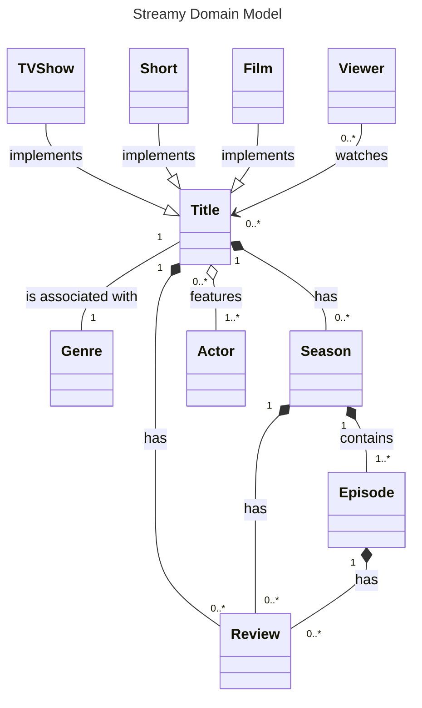

markdown
# Streamy Domain Model - UML Class Diagram

```mermaid
---
title: Streamy Domain Model
---
classDiagram
    TVShow --|> Title : implements
    Short --|> Title : implements
    Film --|> Title : implements

    Title "1" -- "1" Genre : is associated with
    Title "1" *-- "0..*" Season : has
    Title "1" *-- "0..*" Review : has
    Title "0..*" o-- "1..*" Actor : features

    Viewer "0..*" --> "0..*" Title : watches

    Season "1" *-- "1..*" Episode : contains
    Season "1" *-- "0..*" Review : has
    Episode "1" *-- "0..*" Review : has
```
